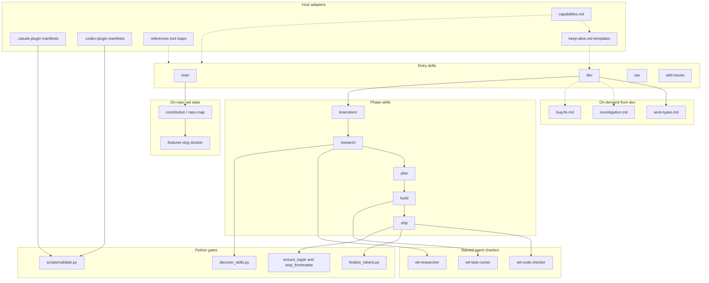

# Architecture - Witloop
_Diagrammed 2026-08-19; updated for the capability table (ADR-0001), work-type routing (1.15.0), and generic PLUGIN_ROOT (1.16.0)._

Legend: solid arrows are the `/wit:dev` sequence and script calls; dashed arrows are host-adapter lookups the skills read rather than own. `dev` loads `work-types.md` on every run; `investigation.md` and `bug-fix.md` are on-demand (investigation exits read-only; bug-fix overlays phases). Four entry skills; one named review agent (`wit-code-checker`). `capabilities.md` is the capability x host matrix; `cursor-tools.md` is one of the tool maps. Entry skills stamp cells into `progress.md`; later phases read that stamp.
