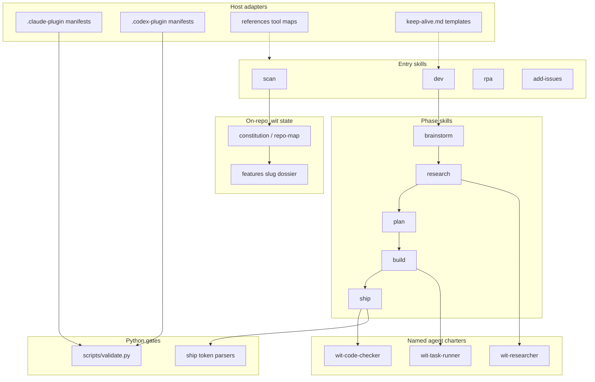

# Architecture - Witloop
_Diagrammed 2026-08-19 by /wit:scan._

Legend: solid arrows are the `/wit:dev` sequence and script calls; dashed arrows are host-adapter lookups the skills read rather than own.
