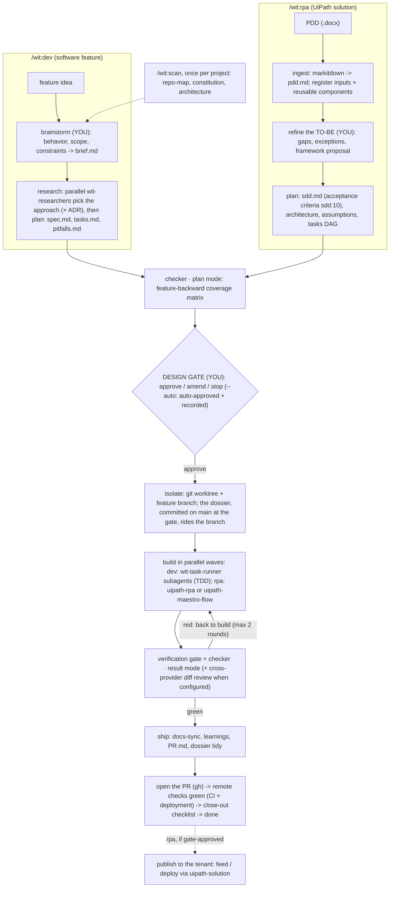

# Witloop: a cross-platform agentic dev loop

**Witloop** (`wit` for short, formerly `wi`) is an opinionated, low-token development loop that runs on **Claude Code**, **Codex CLI**,
**GitHub Copilot CLI**, and **Grok Build** from one source. You scan a project once, then drive each feature with a single
command that talks to you twice (brainstorm and a design gate) and otherwise runs to a pull request on
its own.

| Command | What it does |
|---------|--------------|
| **`/wit:scan`** | Documents an existing project (incl. a mermaid architecture diagram) and bootstraps wit (constitution + optional plugin installs). |
| **`/wit:dev "idea"`** | Brainstorms a feature with you, designs, confirms architecture + design at one gate, then builds and ships hands-off to an open PR. Add `--auto` to auto-approve the gate. |
| **`/wit:rpa "pdd"`** | Parses a PDD (markitdown), refines the TO-BE, writes an SDD + architecture + assumptions, then builds a REFramework or Maestro solution via the UiPath skills (XAML-only or coded, your choice at the design gate) to a PR. One run per PDD (1..N processes); `--auto` supported. |

On Claude the commands are `/wit:scan`, `/wit:dev`, `/wit:rpa`; on Copilot they read `/wit-scan`, `/wit-dev`,
`/wit-rpa`, on Codex `$wit-scan`, `$wit-dev`, `$wit-rpa`, and on Grok `/scan`, `/dev`, `/rpa` (or the `/wit-*`
aliases) - flat aliases scan's bootstrap offers to install
to `~/.agents/skills/` (the raw plugin forms `/wit dev` and `$dev` always work), or, on any harness,
auto-trigger from natural language. Only these three entry points surface as commands; the phase skills
are hidden (`user-invocable: false`) and run inside the loop.

## Install

**Claude Code**
```
/plugin marketplace add Wittenberger-Industries/witloop
/plugin install wit@witloop
```

**Codex CLI**: Codex reads this repo's `.claude-plugin/marketplace.json` and `.codex-plugin/plugin.json`;
add the repo via Codex's plugin flow (`/plugins`) and enable `wit`. Native `/goal` and `CLAUDE_PLUGIN_ROOT`
compatibility work out of the box.

**GitHub Copilot CLI**: install wit as a plugin (Copilot CLI reads this repo's
`.claude-plugin/plugin.json` and `.claude-plugin/marketplace.json` directly, and `skills/` + `agents/` are
its default component paths):
```
copilot plugin marketplace add Wittenberger-Industries/witloop
copilot plugin install wit@witloop
```
Copilot prefixes plugin skills automatically (`/wit scan`, `/wit dev`, `/wit rpa`); the first `/wit scan`
offers to install the one-token aliases `/wit-scan`, `/wit-dev`, `/wit-rpa` (a one-time copy to
`~/.agents/skills/`, which Codex reads too; there they invoke as `$wit-scan`, `$wit-dev`, `$wit-rpa`).

**Migrating from `wi` (pre-1.12.2)**: the plugin id changed `wi` -> `wit` and the marketplace is now
`witloop`, so updates don't carry across: uninstall the old plugin (`/plugin uninstall wi@wi` on Claude,
`copilot plugin uninstall wi@wi` on Copilot), remove any old `wi-*` alias folders from `~/.agents/skills/`,
and install fresh as above. In existing projects, rename the state directory `.wi/` -> `.wit/` (`git mv
.wi .wit`); scan and dev offer this rename automatically when they find a legacy `.wi/`.

Persistence uses Autopilot instead of `/goal`: wit's hands-off handoff prints
`copilot --autopilot --max-autopilot-continues <N> --no-ask-user --allow-all …`. ⚠️ That runs **fully
unattended** (prompts suppressed, all tools/paths granted); drop `--allow-all` to keep risky-action
confirmations. The exact handoff templates and the full warning live in `references/keep-alive.md`.

**Grok Build**: Grok discovers Claude-installed plugins with zero config (no `grok plugin install` step;
Grok loads wit straight from the Claude plugin cache). Install through Claude Code once:
```
/plugin marketplace add Wittenberger-Industries/witloop
/plugin install wit@witloop
```
then enable it for Grok in `~/.grok/config.toml`:
```toml
[plugins]
enabled = ["wit"]
```
Then install the flat `wit-*`
aliases into `~/.agents/skills/` (scan's bootstrap offers the copy): the bare entry points are `/scan`,
`/dev`, `/rpa`, and the aliases add the collision-free `/wit-scan`, `/wit-dev`, `/wit-rpa`. Persistence uses
Grok's native `/goal`, which is **model-judged** (the agent self-completes via `update_goal`), not a hard
predicate, so treat it as Copilot-class autonomy. Handoff templates and the warning live in
`references/keep-alive.md`; tool mappings and the plugin-root resolution rule in
`references/grok-tools.md`.

## Platform differences

wit is one source across three harnesses; only the autonomy spine differs:

| | Claude Code | Codex CLI | Copilot CLI | Grok Build |
|---|---|---|---|---|
| Skills | plugin (`.claude-plugin/`) | `.codex-plugin/` (+ reads `.claude-plugin/marketplace.json`) | `plugin install` (reads `.claude-plugin/`); fallback whole-repo `/skills add` | Claude-plugin discovery, zero config; enable in `~/.grok/config.toml` |
| Keep-alive | built-in `/goal` | native `/goal` | Autopilot flags | native `/goal` (model-judged) |
| Command namespace | `/wit:dev` | `$wit-dev` (alias) / `$dev` | `/wit-dev` (alias) / `/wit dev` | `/wit-dev` (alias) / `/dev` (bare; `/user:dev` on clash) |
| `${CLAUDE_PLUGIN_ROOT}` | native | compat var | the installed plugin root (or the clone) | resolve to the plugin root (env var is hook-only) |
| Subagents | Agent/Task | `spawn_agent` | `task` / `/fleet` | `spawn_subagent` (general-purpose, inline) |

Tool-name mappings live in `references/codex-tools.md`, `references/copilot-tools.md`, and
`references/grok-tools.md`; the cross-platform bootstrap is `AGENTS.md`.

## How it flows

```
/wit:scan                  once per project: documents it, bootstraps wit
/wit:dev "idea"         -> brainstorm (you) -> research -> plan -> check -> DESIGN GATE (you) -> build -> check -> ship -> PR
/wit:dev "idea" --auto  -> same, gate auto-approved & recorded, fully hands-off
/wit:rpa "PDD.docx"     -> ingest(markitdown) -> refine TO-BE (you) -> SDD -> check -> DESIGN GATE (you) -> REFramework/Maestro build -> check -> PR
```

The same machine, two domains; the flows differ until the design gate, then share the spine:



**(YOU)** marks the only two conversations in either flow; everything else runs autonomously, the
post-gate stretch under the keep-alive loop (`/goal` or Autopilot) until ship's close-out checklist
(including the PR's remote checks) passes. At the rpa gate the user also locks the **framework**
(REFramework | Maestro), the **build paradigm** (XAML-only | coded `.cs`), and the **publish** decision
(none | feed | deploy).

The **check** steps are wit's read-only **checker** agent. In *plan mode* (before the gate) it builds a
coverage matrix (every acceptance criterion, locked decision, glossary term, and pitfall mapped to a
covering task) and flags silent scope-reduction or over-build as BLOCKER / WARNING / INFO for the gate to
weigh. In *result mode* (at ship) it confirms each criterion and locked decision was actually delivered and
**wired**, not just present, and runs the line-level code review inline (superpowers' reviewer template
when installed, wit's built-in review otherwise). It feeds the gate and the ship review.

At handoff wit arms a keep-alive loop so the run continues across turns until the PR condition holds:
Claude Code & Codex use their built-in `/goal`; Copilot uses Autopilot. wit works without it too, just less
robustly through a stalled turn.

## The `.wit/` directory

```
.wit/
├── constitution.md      # project rules: written once, read by every phase
├── repo-map.md          # cached scan: stack + exact commands + conventions + frontend/backend
├── overview.md          # readable docs of an existing project (skipped for greenfield)
├── architecture.md      # mermaid architecture diagram (scan; kept current by ship)
├── glossary.md          # project domain terms (brainstorm): canonical names + aliases
├── adr/                 # project-wide decision log: ADR-0001, ADR-0002, ... (+ index.md)
├── learnings.md         # learnings index: one line + hook per feature; phases read this, not the dir
├── learnings/           # substantial per-feature learnings in their own .mds; compounds across features
├── roadmap.md           # optional: ordered features for a larger effort
├── models.md            # optional: tiered model routing, model assignments per dispatched agent
└── features/<slug>/
    ├── progress.md      # the feature's state machine (source of truth)
    ├── brief.md         # brainstorm output: what you want
    ├── research/        # researcher notes + the chosen approach
    ├── spec.md          # plan: what/why + testable acceptance criteria
    ├── tasks.md         # plan: small ordered tasks (files + verification)
    ├── pitfalls.md      # plan: failure modes for this change
    ├── verification.md  # checker output (plan + result mode), ephemeral; verdict folds into PR.md
    ├── tokens.md        # token ledger: the per-run cost report (finalized before the PR)
    └── PR.md            # the PR description; committed, used by gh pr create
```

Every file above is a typed **OKF** knowledge doc: it opens with YAML frontmatter carrying a `type` (plus
title / description / timestamp), so each phase (and `validate.py`) can parse the dossier mechanically.

## Skills & agents

| Skill | Invoke (Claude) | Role |
|-------|-----------------|------|
| `scan` | `/wit:scan` | Document an existing project and bootstrap wit; `--refresh` = drift check + learnings consolidation |
| `dev` | `/wit:dev "idea"` | The interactive entry: brainstorm, then hand off |
| `rpa` | `/wit:rpa "pdd"` | RPA entry: ingest PDD -> refine TO-BE -> SDD -> REFramework/Maestro build via UiPath skills -> PR |
| `brainstorm` | via `dev` | The requirements dialogue (the one interactive phase) + glossary upkeep |
| `research` | via `dev` | The design half: research -> plan -> design gate (your confirmation) |
| `plan` | via `research` | spec + tasks + pitfalls (+ ADR) |
| `build` | post-gate | worktree + parallel waves of task subagents (TDD) |
| `ship` | post-gate | gate -> review -> docs-sync -> learnings -> PR.md -> tidy + tokens -> open PR -> checklist |

Only `scan`/`dev`/`rpa` are user-invocable commands; the five phase skills carry `user-invocable: false`;
hidden from every slash picker, reachable through the loop and by natural language ("ship it"). On
Copilot/Codex the entry points also install as flat one-token aliases (`/wit-dev`, `$wit-dev`, …) from
`references/skill-aliases/`.

Agents: **task-runner** (executes one build task in isolation), **researcher** (picks the approach in the
autonomous phase), and **checker** (read-only verification working backward from the feature's acceptance
criteria: the **check** steps above). The
GSD-derived hardening that ships with these: the researcher tags every claim `[VERIFIED]` / `[CITED]` /
`[ASSUMED]` and runs a **Runtime State Inventory** on rename/migration features (the runtime state a `grep`
can't see); the task-runner follows a typed deviation taxonomy (auto-fix small bugs, STOP-and-ask on
architectural changes), self-checks before claiming done, and respects worktree git-safety rules. Every
skill auto-triggers from natural language too.

## Structure

```
.
├── .claude-plugin/
│   ├── marketplace.json   # marketplace (Claude; Codex reads this too)
│   └── plugin.json        # the wit plugin manifest
├── .codex-plugin/
│   └── plugin.json        # Codex plugin manifest
├── skills/                # scan, dev, brainstorm, research, plan, build, ship, rpa
├── agents/                # task-runner, researcher, checker
├── references/            # codex-tools.md, copilot-tools.md (tool maps); skill-aliases/ (flat /wit-* entry aliases)
├── scripts/validate.py    # pre-release check (frontmatter, JSON, cross-refs, OKF)
├── docs/                  # specs & plans
├── AGENTS.md              # cross-platform bootstrap (Codex + Copilot)
└── README.md              # you are here
```

## Setup & conventions

- **No required env vars or MCP servers.** `/wit:scan` offers to install the optional skills wit delegates to.
- **Tiered model routing (optional).** `.wit/models.md` assigns a model per dispatched agent (orchestrator
  (informational), `wit-code-checker`, `wit-researcher`, `wit-task-runner`) plus an independent
  **cross-provider diff review** (e.g. GPT via `OPENAI_API_KEY`), a layer on top of the checker's
  result-mode pass at ship. Smart/simple presets, set up once on the first wit run, every cell overridable;
  see `references/models.md`. Without the file, everything inherits the session model as before.
- **Mixture of Agents (optional, off by default).** The `## Mixture of Agents` section in `.wit/models.md`
  puts N proposer agents on the same judgment (the research approach decision and the ship review) with
  an optional second refinement layer; one aggregator synthesizes the single answer. Neither preset enables
  it (`points: none`); see `references/moa.md`.
- **Python-first** defaults (uv · pytest · ruff · mypy), stack-agnostic: `scan` records whatever the repo
  uses, and `constitution.md` is where you override.
- Opening the PR uses `gh` if available; otherwise wit pushes the branch and leaves the PR command for you.

## Plays well with (optional, auto-detected)

- **obra/superpowers**: brainstorming, writing-plans, subagent-driven-development, using-git-worktrees,
  test-driven-development, requesting-code-review, verification-before-completion,
  finishing-a-development-branch. Installable on Claude, Codex, and Copilot; used when present, with light
  fallbacks when not.
- **anthropics/skills:frontend-design** (+ `pbakaus/impeccable`, `leonxlnx/taste-skill`) for `[frontend]`
  tasks.

If none are installed, wit still runs the whole loop on its own.

## Design principles

1. **State on disk, not in context.** A `.wit/` folder of small Markdown files lets phases hand off cheaply
   and survive a fresh context window.
2. **Two conversations, two gates.** Brainstorm sets scope; the design gate confirms architecture +
   design; everywhere else wit is autonomous.
3. **Delegate and summarize, in parallel.** Subagents do the heavy reading/editing and return short
   reports, dispatched concurrently in waves wherever the dependency graph allows.
4. **Borrow, don't reinvent.** Detect installed skills (superpowers, frontend-design) and hand off; ship
   light fallbacks so it still works standalone.
5. **An opinionated baseline beats no opinion.** Sensible defaults (Python-first), overridable per project
   in `constitution.md`.
6. **Compounds across features.** Each feature reads the project's memory (constitution, glossary, learnings) and
   writes back what it learned, so the next one starts smarter.
7. **Build the least that works.** A Simplicity discipline threads through the loop: YAGNI, prefer the
   stdlib or an existing dep over a new one, deletion over addition. The checker flags over-build, and the
   design gate sees the *leaner path* next to the chosen approach.

## Maintaining

- **Validate before publishing:** from the repo root, `python scripts/validate.py` (or `python3`): checks
  manifests are valid JSON, every skill/agent has valid `name`+`description` frontmatter, every
  `${CLAUDE_PLUGIN_ROOT}` reference resolves, and every concept doc is **OKF**-conformant (typed YAML
  frontmatter) with no truncated-write signatures: a missing trailing newline or unbalanced code fences.
  `pip install pyyaml` enables the full frontmatter parse.
- **Version tracks skill/agent changes:** any change under `skills/` or `agents/` bumps `version` in the
  same PR, all three manifests: `.claude-plugin/plugin.json`, the `marketplace.json` plugin entry, and
  `.codex-plugin/plugin.json` (`validate.py` enforces the three-way parity). The installed cache
  is keyed by version, so shipping new bytes under an unchanged version leaves sessions serving stale
  skills/agents: "same version, different bytes" makes support and repro guesswork.
- **Claude local-marketplace updates:** bump `version` in `.claude-plugin/plugin.json` (+ the marketplace
  entry and `.codex-plugin/plugin.json`), then `/plugin marketplace update wit` and `/reload-plugins` (or
  restart). Codex re-reads the repo through its own install/update flow; on Copilot, `copilot plugin
  update wit` pulls the new version (clone-based installs re-pull with `git pull`).
- **Agent naming:** the `wit-` prefix on `agents/` files is a deliberate cross-platform tag (PR #15); on
  Claude the namespace renders as `wit:wit-<name>` (e.g. `wit:wit-code-checker`); the stutter is accepted,
  don't "fix" it back. The checker is intentionally `wit-code-checker` (not `wit-checker`); skills and docs
  call it **the checker** for short.
- **Rolling back the rpa parity layer (v0.10.1):** the rpa feature-level verification + Simplicity + Runtime
  State Inventory + worktree-safety wiring is **additive and behavior-only**: no data or migration impact.
  If `/wit:rpa` starts failing because of it, revert the whole layer: `git revert <the v0.10.1 rpa-parity
  squash-merge commit>` (find it via `git log --oneline --grep "rpa flow to parity"`). It touches exactly
  six files (`agents/wit-code-checker.md`, `skills/rpa/SKILL.md`, and under `skills/rpa/references/`:
  `verification-gate.md`, `brainstorm-protocol.md`, `rpa-constitution-template.md`, `build-uipath.md`) so a
  manual revert of those restores the prior rpa behavior. The dev spine is unaffected.

## Roadmap

- **Remote checks gate at ship** (v1.5.0) shipped: ship now waits for the PR's remote checks (CI +
  deployment) after opening it: green is logged with run URLs; red enters a bounded fix loop with the
  worktree kept; close-out, worktree cleanup, and the success summary come only after the remote gate;
  the final report separates local and remote status
  (`local gate: green · PR checks: N/N green · deployment: ready`) and the `/goal` template includes
  remote checks.
- **Mixture of Agents** (v1.4.0) shipped: a real MoA layer at wit's two judgment points (research approach
  selection, ship review): N proposers → optional second layer → aggregator, configured in `.wit/models.md`
  (`points: none` by default; neither preset enables it).
- **Issue sweep** (v1.3.0) shipped: the `/goal` handoff now advances in the same turn the goal registers;
  the tiered-models layer is renamed to **tiered model routing** (`.wit/models.md`, `cross_review.py`,
  `cross-review.md`) with the cross-provider review documented as a standalone layer; the feature dossier
  is committed on main at the design gate; a superpowers precedence rule + delegation matrix land in
  `skills/research/references/integrations.md`; the line-level review is unified into wit-code-checker's
  result mode.
- **One-token entry commands on Copilot/Codex** (v1.2.0) shipped: Copilot auto-prefixes plugin skills
  (`/wit dev`; the prefix isn't configurable), so wit ships flat forwarding aliases
  (`references/skill-aliases/`) that scan's bootstrap offers to copy to `~/.agents/skills/`: the entry
  points read `/wit-scan`, `/wit-dev`, `/wit-rpa` on Copilot and `$wit-*` on Codex; `/wit:*` unchanged on
  Claude. The five phase skills are now `user-invocable: false`: hidden from slash pickers everywhere,
  still natural-language- and orchestrator-invocable.
- **Tiered models + cross-provider review** (v1.1.0) shipped (renamed to **tiered model routing** in
  v1.3.0): an optional per-agent model config (today `.wit/models.md`) assigns a model per dispatched
  agent (`wit-code-checker`, `wit-researcher`, `wit-task-runner`; the `orchestrator` tier
  is informational, warned-on-mismatch only), chosen once via a **smart / simple / custom** preset and
  overridable per cell. `smart` layers an **independent cross-provider diff review**, another model family
  (e.g. GPT via `OPENAI_API_KEY`), on top of the checker's result-mode pass at ship; `simple` (the `--auto`
  default) is a lean opus/sonnet pass-through, no top-tier default. A follow-up renamed the roles to wit's
  real dispatch targets and folded the standalone reviewer into the checker's result mode. Design and plan
  in `docs/specs/` and `docs/plans/`.
- **Maestro as a build framework** (v1.0.0) shipped: `wit:rpa` now targets UiPath Maestro flows as a
  first-class framework alongside REFramework: a `Framework: reframework | maestro` choice (above the build
  paradigm) proposed at brainstorm and confirmed at the gate makes the architecture, SDD, build, and
  verification framework-aware; the Maestro path builds/validates/evals via `uipath-maestro-flow`. Design
  and plan in `docs/specs/` and `docs/plans/`.
- **rpa tenant publish** (v0.11.0) shipped: `wit:rpa` can publish a verified, PR'd build to a connected
  Orchestrator tenant: the design gate approves `Publish: none | feed | deploy` (+ folder, prod-guarded),
  and ship delegates `pack`/`publish`/`deploy`/`activate` to `uipath-solution`, best-effort, hands-off-safe.
  Next: Maestro flow as a build paradigm. Design and plan in `docs/specs/` and `docs/plans/`.
- **Numbered feature directories** (v0.10.5) shipped: new features get a global 4-digit ordinal prefix as part
  of the slug (`0001-<name>`, mirroring `ADR-NNNN`), so `.wit/features/` lists in implementation order, visible
  in the directory, the branch name, and the PR. dev + rpa; existing features untouched. Design and plan in
  `docs/specs/` and `docs/plans/`.
- **tokens.md guardrails** (v0.10.4) shipped: the per-feature token ledger can no longer be silently
  skipped: a deterministic scaffold (`check_tokens.py --init`), `token_report.py --write` finalizes the
  orchestrator total + Subagents sum in place, and a `check_tokens.py` close-out gate blocks the PR on a
  genuine skip (an honest `unavailable` still ships). Dev + rpa flows; design and plan in `docs/specs/`
  and `docs/plans/`.
- **Agent verification layer** (v0.9.2-v0.10.0) shipped: a read-only **checker** (feature-backward
  verification, plan + result modes), researcher provenance + a **Runtime State Inventory**, a task-runner
  deviation taxonomy + self-check, and a **Simplicity** discipline across the loop; distilled from
  GSD-core's agent patterns and recorded in `docs/specs/2026-06-14-agent-upgrades-from-gsd.md`.
- **Cross-platform** (Codex CLI + Copilot CLI) support shipped: one source, per-platform packaging + a
  platform-aware autonomy spine. Design and plan in `docs/specs/` and `docs/plans/`.
- **`/wit:rpa`** (v0.7.0): PDD -> SDD -> REFramework build via the UiPath skills, build paradigm chosen at
  the design gate (XAML-only default, or coded `.cs`). Next: a dry-run to harden it, Flow/non-REFramework
  targets, and deeper Orchestrator provisioning.
