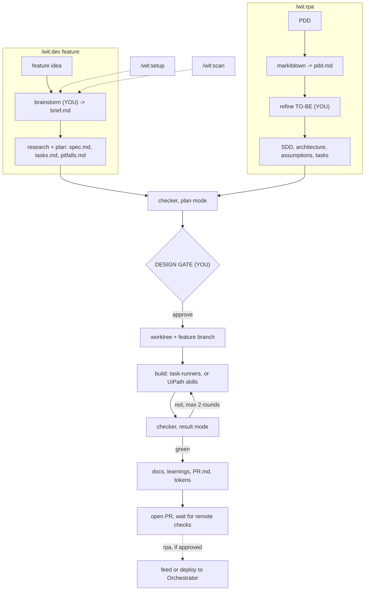

# Witloop

Witloop is a plugin (`wit`) that takes a software change or a UiPath PDD from a conversation to an open pull request. Set up a repo once. After that, one command runs the loop. You talk at brainstorm and at a design gate. The rest is autonomous.

It runs on **four hosts**: Claude Code, GitHub Copilot CLI, Grok Build, and Cursor. Current release is **1.16.2**.

| Command | What it does |
|---------|--------------|
| **`/wit:setup`** | First-run: repo docs, constitution, plugin offer, models preset, tokens ledger. `--auto` writes simple plus ledger on. |
| **`/wit:scan`** | Refresh-only: drift-checks the map and consolidates learnings. Missing `repo-map.md` runs setup first. Bare invoke is silent `--refresh`. |
| **`/wit:dev "idea"`** | Routes `feature`, `bug-fix`, or `investigation`, then runs that path. `--kind` overrides. Add `--auto` to auto-approve the design gate. |
| **`/wit:rpa "pdd"`** | Reads a PDD, refines the TO-BE with you, writes an SDD, then builds REFramework or Maestro (XAML or coded) to a PR. `--auto` supported. |
| **`/wit:add-issues`** | Files a GitHub Bug, Feature, or Task via `gh`. To file a bug as an issue, use this, not `/wit:dev`. |

Only these five entry points show up as slash commands. Brainstorm, research, plan, build, and ship stay hidden and run inside the loop. Natural language still triggers them ("ship it", "scan this repo").

On Claude the names are `/wit:setup` and so on. Copilot uses `/wit-setup` after setup copies aliases into `~/.agents/skills/` (`/wit setup` always works). Grok uses `/wit-setup` (prefer branded; bare `/setup` may clash). Cursor loads plugin skills and auto-triggers from each skill description.

## Work types

`/wit:dev` is still one of those five commands. Before it writes anything, it deduces a work type. `--kind feature|bug-fix|investigation` overrides. Mixed or unclear intent is announced as `feature`. It never asks and never routes silently.

- **feature** (default). Brainstorm, design gate, build, ship, PR.
- **investigation**. A read-only cited answer this turn. No dossier, design gate, keep-alive, or PR.
- **bug-fix**. Repro first. The same-surface must fail then pass. A fail-closed narrow-fix may skip the human design-gate ask with the stamp `design gate bypassed (narrow-fix)`, which is distinct from `--auto`. `--auto` still auto-approves the design gate. The bypass is a different, evidence-gated skip.

Runtime procedure: `skills/dev/SKILL.md`, `skills/dev/references/work-types.md`, `investigation.md`, `bug-fix.md`.

## Install with an agent

Give the agent this repo and tell it to install Witloop for the host it is running in:

https://github.com/Wittenberger-Industries/witloop

```
Install the Witloop plugin (id wit) from https://github.com/Wittenberger-Industries/witloop
using this host's plugin marketplace or plugin install flow. Then confirm a setup command is available.
```

The agent should pick this host's plugin marketplace commands from Install below, without being walked through each one.

## Install

**Claude Code**
```
/plugin marketplace add Wittenberger-Industries/witloop
/plugin install wit@witloop
```

**GitHub Copilot CLI**
```
copilot plugin marketplace add Wittenberger-Industries/witloop
copilot plugin install wit@witloop
```

**Grok Build**
```
grok plugin marketplace add Wittenberger-Industries/witloop
grok plugin install wit --trust
```

**Cursor**
```
/plugin marketplace add https://github.com/Wittenberger-Industries/witloop
/plugin install wit@witloop
```

## Hosts

Same skills everywhere. Host behavior: `references/capabilities.md`. Tool maps: `references/copilot-tools.md`, `references/grok-tools.md`, `references/cursor-tools.md`.

| | Claude Code | Copilot CLI | Grok Build | Cursor |
|---|---|---|---|---|
| Keep-alive | `/goal` | Autopilot relaunch | `/goal` (model-judged) | `/goal` (model-judged) |
| Invoke | `/wit:dev` | `/wit-dev` / `/wit dev` | `/wit-dev` / `/dev` | plugin skill + auto-trigger |

## How a run works

```
/wit:setup                        once per project
/wit:scan                         refresh the map
/wit:dev "idea"                   work type (feature default) -> brainstorm (you) -> research -> plan -> check -> DESIGN GATE (you) -> build -> check -> ship -> PR
/wit:dev "idea" --auto            same, design gate auto-approved and recorded
/wit:dev "idea" --kind investigation   read-only cited answer; no dossier, gate, keep-alive, or PR
/wit:dev "idea" --kind bug-fix    repro-first; same-surface fail then pass; narrow-fix may stamp design gate bypassed (narrow-fix)
/wit:rpa "PDD.docx"               ingest -> refine TO-BE (you) -> SDD -> check -> DESIGN GATE (you) -> REFramework/Maestro build -> check -> PR
/wit:add-issues                   draft -> confirm -> gh issue create
```

Investigation never enters this diagram. Bug-fix reuses the feature spine, with a repro recorded at brainstorm and the same named surface required to fail then pass.


```mermaid
flowchart TD
  subgraph devlane["/wit:dev feature"]
    idea["feature idea"] --> brainstorm["brainstorm (YOU) -> brief.md"]
    brainstorm --> planp["research + plan: spec.md, tasks.md, pitfalls.md"]
  end

  subgraph rpalane["/wit:rpa"]
    pddin["PDD"] --> ingest["markitdown -> pdd.md"]
    ingest --> tobe["refine TO-BE (YOU)"]
    tobe --> sddplan["SDD, architecture, assumptions, tasks"]
  end

  setup["/wit:setup"] -.-> brainstorm
  scan["/wit:scan"] -.-> brainstorm
  planp --> precheck["checker, plan mode"]
  sddplan --> precheck
  precheck --> gate{"DESIGN GATE (YOU)"}
  gate -->|approve| isolate["worktree + feature branch"]
  isolate --> build["build: task-runners, or UiPath skills"]
  build --> verify["checker, result mode"]
  verify -->|"red, max 2 rounds"| build
  verify -->|green| ship["docs, learnings, PR.md, tokens"]
  ship --> pr["open PR, wait for remote checks"]
  pr -.->|"rpa, if approved"| publish["feed or deploy to Orchestrator"]
```

You speak twice on a feature or rpa run. After the gate, a keep-alive loop (`/goal` or Copilot Autopilot) keeps the session moving until the PR's remote checks pass. At the rpa gate you also lock framework (REFramework or Maestro), build shape (XAML or coded `.cs`), and publish (none, feed, or deploy).

The **checker** is a read-only agent. Plan mode maps every acceptance criterion to a task before the gate. Result mode checks that each criterion was delivered and wired, then reviews the diff. It is `wit-code-checker` in `agents/`. On Claude the namespace renders `wit:wit-code-checker`. Leave the stutter.

## `.wit/` in a project

```
.wit/
├── constitution.md      project rules
├── repo-map.md          stack, exact commands, conventions
├── overview.md          readable tour of an existing repo
├── architecture.md      mermaid diagram
├── glossary.md          domain terms
├── adr/                 ADR-0001, ADR-0002, ...
├── learnings.md         index; phases read this, not the directory
├── learnings/           per-feature notes
├── roadmap.md           optional ordered queue
├── models.md            optional per-agent model routing
└── features/<slug>/
    ├── progress.md      state machine
    ├── brief.md         what you asked for
    ├── research/        chosen approach
    ├── spec.md          acceptance criteria
    ├── tasks.md         ordered work
    ├── pitfalls.md      failure modes
    ├── verification.md  checker output
    ├── tokens.md        cost report
    └── PR.md            used by gh pr create
```

Each of those files opens with YAML frontmatter (`type`, title, description, timestamp) so a phase can parse it without guessing.

## Optional

No env vars or MCP servers are required. `/wit:scan` offers to install helper skills.

`.wit/models.md` can assign a model per dispatched agent and, on the `smart` preset, an extra cross-provider diff review at ship. See `references/models.md`. Mixture of Agents is off unless you set `points` in that file. See `references/moa.md`.

If `obra/superpowers` or `frontend-design` are installed, wit delegates at named points and keeps its own artifact formats. It runs without them.

`gh` opens the PR when present. Otherwise wit pushes the branch and leaves the create command for you.

Python-first defaults (uv, pytest, ruff, mypy). `scan` records whatever the repo actually uses. Override in `constitution.md`.

## This repo

```
.
├── .claude-plugin/      marketplace.json + plugin.json
├── skills/              setup, scan, dev, rpa, add-issues, plus hidden phase skills
├── agents/              wit-task-runner, wit-researcher, wit-code-checker
├── references/          host adapters, capabilities.md, keep-alive.md, skill-aliases/
├── scripts/validate.py  manifests, frontmatter, cross-refs
├── docs/                specs, plans, live roadmap
└── AGENTS.md            bootstrap for non-Claude hosts
```

Before a release: `python scripts/validate.py` (or `python3`) and `python -m unittest discover -s tests`. Install PyYAML for a full frontmatter parse.

Any change under `skills/` or `agents/` bumps `version` in the same PR in all plugin manifests. The installed cache is keyed by version.

Open work lives in `docs/roadmap.md`, not here.
