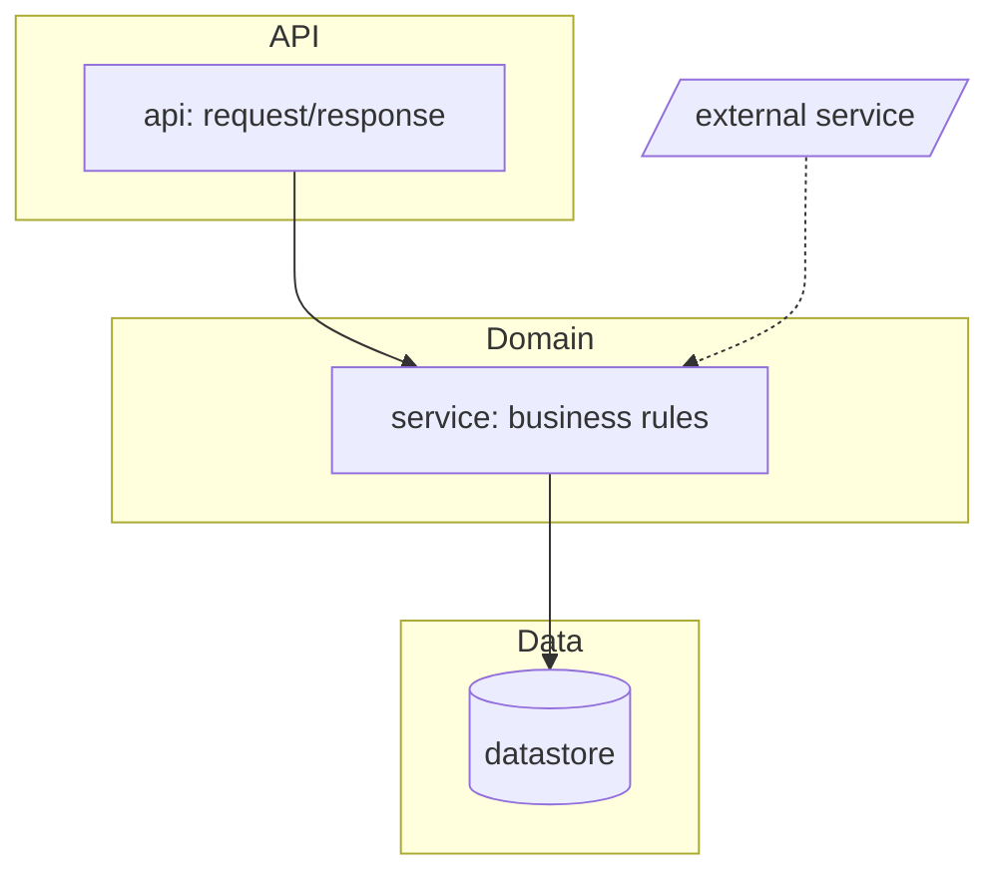

# /wi:scan — understand the project, then bootstrap wi

scan does the one-time groundwork so `/wi:dev` can run smoothly later. Two jobs:

1. **Understand** what's in this folder and write it down.
2. **Bootstrap** wi: the constitution, and the optional plugins wi leans on.

Outputs (all under a committed `.wi/`):
- `repo-map.md` — terse facts: stack, the exact test/lint/typecheck/run commands, layout, conventions.
  Read by every later phase.
- `overview.md` — readable documentation of an **existing** project (skipped for an empty/greenfield folder).
- `architecture.md` — a **mermaid** diagram of the architecture (existing projects; skipped for greenfield).
- `constitution.md` — the project's ground rules (bootstrapped if absent).

Plus a plugin check that may install the skills wi delegates to.

## Procedure

1. **Confirm the root & census the folder.** `git rev-parse --show-toplevel` (init only if the user wants
   it). Decide **greenfield vs existing**: `git ls-files | wc -l` plus a top-level listing. A near-empty
   folder is greenfield; anything with real source is existing.

2. **If existing code — understand it and document it.** Use the cookbook in
   `${CLAUDE_PLUGIN_ROOT}/skills/scan/references/stack-detection.md` to read config/lock files (not source
   wholesale). Produce **three** files:
   - `repo-map.md` (template below) — the machine-facing facts and exact commands.
   - `overview.md` (template below) — a human-facing tour: what this project is, how it's organized, how
     to run it, the conventions a newcomer must know.
   - `architecture.md` (template below) — a **mermaid** flowchart of the real architecture: the key
     modules/components and how they depend on or pass data to each other (not a file-by-file dump).
   On a large repo, **dispatch a subagent** to read broadly and return the filled-in templates — don't
   pull the whole tree into this context.

   **If greenfield (empty, or no stack detectable), run a guided setup — don't just mark it UNKNOWN.**
   The point is to give later phases real ground truth. In one focused round (AskUserQuestion, folded into
   the constitution-confirm of step 4 so the user answers once), define:
   - primary language(s) + version, framework(s), and package manager;
   - the intended **test / lint / format / typecheck / run** commands.
   Offer sensible per-language defaults and let the user confirm or override — e.g. Python →
   uv · pytest · ruff · mypy · src layout; Node/TS → pnpm · vitest · eslint · prettier · tsc. Write the
   confirmed answers into `repo-map.md` (`Kind: greenfield`) and seed `constitution.md` from them; skip
   `overview.md` (nothing to document yet). Anything the user genuinely can't answer → `UNKNOWN — ask`;
   don't invent it. A later scaffolding goal can fill the gaps — but the intent is now on record. Also drop a
   stack-appropriate `.gitignore` (caches, build artifacts) so the first build doesn't leak them.

3. **Classify frontend / backend / both.** A UI framework in `package.json` or a `components/` tree ⇒
   frontend present. Record it — build routes `[frontend]` tasks to a design skill.

4. **Bootstrap the constitution.** If `.wi/constitution.md` is absent, copy
   `${CLAUDE_PLUGIN_ROOT}/skills/scan/references/constitution-template.md`, fill in what you detected, and
   ask the user to confirm the few lines marked `(confirm)`. If it already exists, leave it.

5. **Plugin bootstrap (offer, don't force).** Follow
   `${CLAUDE_PLUGIN_ROOT}/skills/scan/references/plugin-bootstrap.md`: check which recommended plugins are
   available; for any missing, use AskUserQuestion to offer installing them, and on yes give/run the exact
   `/plugin marketplace add` + `/plugin install` commands. wi works fully without them — this is an
   enhancement, not a requirement.

6. **Report** (4-8 lines): stack, frontend/backend, what docs were written, which plugins are present vs
   newly installed, and anything left `UNKNOWN`.

## `repo-map.md` template

```markdown
# Repo map  (scanned <YYYY-MM-DD>)

- **Kind:** existing | greenfield
- **Languages:** <e.g. Python 3.12, TypeScript>
- **Package manager:** <uv / poetry / pip / pnpm / npm / cargo / go mod>
- **Frontend / backend:** <backend only | frontend only | both — frameworks>
- **Layout:** <src layout? monorepo? key top-level dirs>
- **Architecture:** see `architecture.md` (mermaid module/dependency diagram)

## Commands  (verified runnable)
- **Install:** `<cmd>`
- **Test (all):** `<cmd>`     - **Test (one):** `<cmd e.g. pytest path::test_name>`
- **Lint:** `<cmd>`           - **Format:** `<cmd>`
- **Typecheck:** `<cmd>`      - **Run / dev:** `<cmd>`     - **Build:** `<cmd or n/a>`
- **Tests parallel-safe:** <yes / no / unknown — shared db file? fixed ports? pytest-xdist?>

## CI
- **Provider/files:** <.github/workflows/*, etc.>  - **Enforces:** <tests, lint, coverage>

## Conventions
- **Style/lint:** <ruff/eslint + notable rules>  - **Tests in:** <dir + naming>
- **Imports/module style:** <notes>

## Entry points
- <main module / CLI / server entry / app root>

## Unknowns
- <things to confirm with the user>
```

## `overview.md` template (existing projects)

```markdown
# <project> — overview  (documented <YYYY-MM-DD> by /wi:scan)

## What it is
<1-3 sentences: purpose and who uses it.>

## Stack
<languages, frameworks, notable dependencies.>

## How it's organized
<top-level dirs and what lives in each; the key modules/packages and their roles.>

## Run it
<install, run/dev, test — point at repo-map.md for exact commands.>

## Data & external services
<datastores, APIs, queues, auth — or "none".>

## Conventions & gotchas
<patterns a newcomer must know; surprising bits; where NOT to go.>

## Open questions
<anything scan couldn't determine from the code.>
```

## `architecture.md` template (existing projects)

Write a `# Architecture — <project>` heading, a dated line, ONE primary mermaid `flowchart` of the real
architecture, then a one-line legend. Example shape:



Rules: ~10-25 nodes; group with `subgraph` by layer/area; nodes are modules/components, **not files**;
edges are real dependencies / data flow; `[( )]` = datastore, `/ /` = external system; solid = calls/
depends, dashed = optional/async.

Mermaid has two syntax traps — both **must** be avoided or the whole diagram fails to render:
1. **Quote every node label** containing `:` `/` `->` `+` `(` `)` as `id["..."]` — a bare special char
   breaks the parser.
2. **Node IDs are identifiers, not display names.** Keep them short and safe (`[a-z][a-z0-9_]*`) and
   **never use a mermaid reserved word as an ID**: `graph`, `end`, `subgraph`, `class`, `classDef`,
   `style`, `linkStyle`, `click`, `state`, `direction`, `flowchart`, `default`. Put the module's real name
   in the quoted label, not the ID — e.g. `gbuild["graph: builder / nodes"]`, **not** `graph["..."]`
   (that exact collision is a real parse failure: mermaid reads `graph` as the diagram keyword). When a
   module's name is a keyword, suffix the ID (`graph_mod`, `end_node`).

Add a second diagram only if it genuinely adds clarity.

**Validate the diagram for real before committing** — don't eyeball it:

```
python3 ${CLAUDE_PLUGIN_ROOT}/skills/scan/scripts/check_mermaid.py .wi/architecture.md
```

The bundled checker catches the actual failure modes (reserved-word node IDs, unquoted special-char
labels, unbalanced `subgraph`/`end`, unclosed fence) and, when `mmdc` (mermaid-cli) is installed, also
does a true render. Fix every error it prints; never save a diagram that doesn't pass.

Keep these files tight and skimmable — they're read at the top of later phases, so bloat is paid for many
times over.
