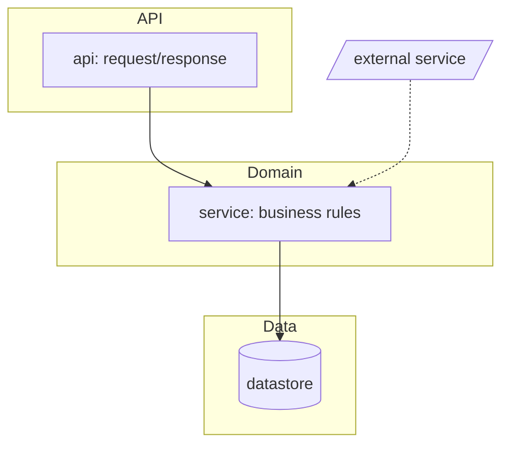

# /wit:setup (first-run: document the project, then bootstrap wit)

One sitting creates a usable `.wit/`: repo docs, constitution, optional helper plugins, models
preset, and a keep-or-skip tokens ledger.

**Missing `.wit/repo-map.md` is the empty-project path** (do not key off a missing `.wit/` directory;
add-issues may already have created `.wit/issues/`). Already have a map? `/wit:scan` refreshes; this
skill does not re-document.

**`--auto`** writes the **simple** models preset and `## Token ledger` with `ledger | on`. Do not ask
the models or ledger questions.

Design rationale for this skill lives in the wit repo's `docs/design-notes/setup.md` (maintainer doc,
never loaded at runtime).

Outputs (all under a committed `.wit/`):
- `repo-map.md`: terse facts (stack, the exact test/lint/typecheck/run commands, layout, conventions).
  Read by every later phase.
- `overview.md`: readable documentation of an **existing** project (skipped for greenfield).
- `architecture.md`: a **mermaid** diagram of the architecture (existing projects only).
- `constitution.md`: the project's ground rules (bootstrapped if absent).
- `models.md`: model-routing preset plus `## Token ledger` (`ledger` `on` | `skip`).

Plus a plugin check (setup:5) that may install the skills wit delegates to.

## Procedure

**Host probe (once at entry).** Detect `claude` | `codex` | `copilot` | `grok` | `cursor` per **the
capability table** (`${PLUGIN_ROOT}/references/capabilities.md` Host probe; same tells as
`wit:dev`). Plugin root per capabilities.md **Plugin root** (never pass unexpanded `${PLUGIN_ROOT}`).
Setup has no feature `progress.md`: keep the slug in-session (plugin-bootstrap reads
it). A later `dev` / `rpa` stamps `Host:` + `Plugin root (resolved):` + `## Capabilities (resolved)`.
Do not seed `## Model routing (resolved)` here.

1. **Confirm the root & census the folder.** `git rev-parse --show-toplevel` (init only if the user wants
   it). Decide **greenfield vs existing**: `git ls-files | wc -l` plus a top-level listing. A near-empty
   folder is greenfield; anything with real source is existing.
   **Legacy state dir:** if the project has a `.wi/` (pre-1.12.2 name) and no `.wit/`, offer to rename it
   (`git mv .wi .wit`, one commit) and treat it as `.wit/` from then on; don't create a second state dir.

2. **If existing code, understand and document it.** Use the cookbook in
   `${PLUGIN_ROOT}/skills/scan/references/stack-detection.md` to read config/lock files (not source
   wholesale) and produce the three files from the templates below: `repo-map.md`, `overview.md`,
   `architecture.md`. On a large repo, **dispatch a subagent** to read broadly and return the filled-in
   templates; never pull the whole tree into this context.

   **If greenfield (empty, or no stack detectable), run a guided setup; don't just mark it UNKNOWN.**
   In one focused round (stamped `ask` tool; Claude verb AskUserQuestion, via the host tool map;
   folded into the constitution-confirm of setup:4 so the user
   answers once), define:
   - primary language(s) + version, framework(s), and package manager;
   - the intended **test / lint / format / typecheck / run** commands.
   Offer per-language defaults and let the user confirm or override: Python →
   uv · pytest · ruff · mypy · src layout; Node/TS → pnpm · vitest · eslint · prettier · tsc. Write the
   confirmed answers into `repo-map.md` (`Kind: greenfield`) and seed `constitution.md` from them; skip
   `overview.md`. Anything the user genuinely can't answer → `UNKNOWN - ask`; don't invent it. Also drop
   a stack-appropriate `.gitignore` (caches, build artifacts, `.wit/features/*/.logs/`: wit's redirected
   command output; `.wit/issues/`: add-issues transient drafts). Both of those dirs are also
   self-gitignored (`*` in a dir-local `.gitignore`) when build / add-issues create them - the
   greenfield entry is belt-and-suspenders for projects that have not run those skills yet.

3. **Classify frontend / backend / both.** A UI framework in `package.json` or a `components/` tree ⇒
   frontend present. Record it; build routes `[frontend]` tasks to a design skill.

4. **Bootstrap the constitution.** If `.wit/constitution.md` is absent, copy
   `${PLUGIN_ROOT}/skills/scan/references/constitution-template.md`, fill in what you detected, and
   ask the user to confirm the few lines marked `(confirm)`. If it already exists, leave it.

5. **Plugin bootstrap (offer, don't force).** Follow
   `${PLUGIN_ROOT}/skills/scan/references/plugin-bootstrap.md`: check which recommended plugins are
   available; for any missing, ask with the stamped `ask` tool (Claude verb AskUserQuestion, via
   the host tool map) to offer installing them, and on yes follow that file's host install commands.
   wit works fully without them.

6. **Models preset.** If `.wit/models.md` is **absent**, follow `${PLUGIN_ROOT}/references/models.md`
   **"First-run setup"**: interactive → ask once (*"Model routing: smart, simple, or custom?"*),
   pre-fill from the chosen preset, write the file. **`--auto`** writes the **simple** preset without
   asking. Do not duplicate the preset tables here. Interactive write **omits** `## Token ledger`
   (setup:7 writes it after the ask). `--auto` writes that heading with `ledger | on` in the same
   sitting. When the file exists, skip the write. Do not
   seed `## Model routing (resolved)` (no feature folder yet; that stays at `dev:2` / rpa seed).

7. **Token ledger.** If `.wit/models.md` has no `## Token ledger` heading, ask once whether this
   project keeps a `tokens.md` ledger (`on`) or skips it (`skip`). Write this section (after Roles,
   or after MoA):

   ```
   ## Token ledger
   | Key | Value |
   |------|-------|
   | ledger | on |
   ```

   Interactive writes `on` or `skip` in the Value cell. **`--auto`** always writes `ledger | on`.
   Never skip on `--auto`. Absent heading, absent row, empty cell, or any value other than exact
   `skip` is `on` (fail-closed). Never re-ask (edit `.wit/models.md` to change it). No mid-run toggle.

8. **Commit the setup outputs** (`repo-map.md`, `overview.md`, `architecture.md`, `constitution.md`,
   `models.md`, plus the greenfield `.gitignore` when one was created): `chore(wit): setup` (the
   project-level rule in `wit-directory.md`: committed where written; a constitution override can
   disable wit commits to main). Rename of `.wi` stays its own commit when it happens.

9. **Report** (4-8 lines): stack, frontend/backend, what docs were written, models preset, ledger
   `on` or `skip`, which plugins are present vs newly installed, anything left `UNKNOWN`, and a
   **lean-file warning** when `constitution.md` or `repo-map.md` exceeds the ~150-line ceiling
   (wit-directory.md).

## `repo-map.md` template

Open the file with OKF frontmatter (`type: Repo Map`), then the body below.

```markdown
---
type: Repo Map
title: Repo map - <project>
description: Stack, exact verified commands, and conventions setup recorded for this repo.
timestamp: <YYYY-MM-DD>
---

# Repo map  (scanned <YYYY-MM-DD>)

- **Kind:** existing | greenfield
- **Languages:** <e.g. Python 3.12, TypeScript>
- **Package manager:** <uv / poetry / pip / pnpm / npm / cargo / go mod>
- **Frontend / backend:** <backend only | frontend only | both - frameworks>
- **Layout:** <src layout? monorepo? key top-level dirs>
- **Architecture:** see `architecture.md` (mermaid module/dependency diagram)

## Commands  (verified runnable)
- **Install:** `<cmd>`
- **Test (all):** `<cmd>`     - **Test (one):** `<cmd e.g. pytest path::test_name>`
- **Lint:** `<cmd | n/a - not configured>`           - **Format:** `<cmd | n/a - not configured>`
- **Typecheck:** `<cmd | n/a - not configured>`      - **Run / dev:** `<cmd>`     - **Build:** `<cmd or n/a>`
  (write the `n/a - not configured` token verbatim when a tool genuinely isn't set up - dev's handoff
  preflight and keep-alive.md's fill rule key on that exact string; never leave the cell blank or `UNKNOWN`
  when you've *verified* the tool is absent)
- **Tests parallel-safe:** <yes / no / unknown - shared db file? fixed ports? pytest-xdist?>

## CI
- **Provider/files:** <.github/workflows/*, etc.>  - **Enforces:** <tests, lint, coverage>

## Conventions
- **Style/lint:** <ruff/eslint + notable rules>  - **Tests in:** <dir + naming>
- **Imports/module style:** <notes>

## Entry points
- <main module / CLI / server entry / app root>

## Unknowns
- <things to confirm with the user>
```

## `overview.md` template (existing projects)

Open the file with OKF frontmatter (`type: Overview`), then the body below.

```markdown
---
type: Overview
title: <project> - overview
description: A human-facing tour of what this project is and how it's organized.
timestamp: <YYYY-MM-DD>
---

# <project> - overview  (documented <YYYY-MM-DD> by /wit:setup)

## What it is
<1-3 sentences: purpose and who uses it.>

## Stack
<languages, frameworks, notable dependencies.>

## How it's organized
<top-level dirs and what lives in each; the key modules/packages and their roles.>

## Run it
<install, run/dev, test - point at repo-map.md for exact commands.>

## Data & external services
<datastores, APIs, queues, auth - or "none".>

## Conventions & gotchas
<patterns a newcomer must know; surprising bits; where NOT to go.>

## Open questions
<anything setup couldn't determine from the code.>
```

## `architecture.md` template (existing projects)

Open the file with OKF frontmatter (`type: Architecture`), then a `# Architecture - <project>` heading, a
dated line, ONE primary mermaid `flowchart` of the real architecture, then a one-line legend:

```markdown
---
type: Architecture
title: Architecture - <project>
description: Mermaid module/dependency diagram of the real architecture.
timestamp: <YYYY-MM-DD>
---

# Architecture - <project>
_Diagrammed <YYYY-MM-DD> by /wit:setup._

<the primary mermaid flowchart (shape below), then a one-line legend>
```

Example flowchart shape:



Rules: scale to the codebase (~10-25 nodes on a typical repo, fewer on a small one: 5 honest nodes beat
12 padded ones); group with `subgraph` by layer/area; nodes are modules/components, **not files**;
edges are real dependencies / data flow; `[( )]` = datastore, `/ /` = external system; solid =
calls/depends, dashed = optional/async.

Mermaid has two syntax traps; both **must** be avoided or the whole diagram fails to render:
1. **Quote every node label** containing `:` `/` `->` `+` `(` `)` as `id["..."]`; a bare special char
   breaks the parser.
2. **Node IDs are identifiers, not display names.** Keep them short and safe (`[a-z][a-z0-9_]*`) and
   **never use a mermaid reserved word as an ID**: `graph`, `end`, `subgraph`, `class`, `classDef`,
   `style`, `linkStyle`, `click`, `state`, `direction`, `flowchart`, `default`. Put the module's real
   name in the quoted label, not the ID: `gbuild["graph: builder / nodes"]`, **not** `graph["..."]`.
   When a module's name is a keyword, suffix the ID (`graph_mod`, `end_node`).

Add a second diagram only if it genuinely adds clarity.

**Validate the diagram for real before committing**; don't eyeball it:

```
python ${PLUGIN_ROOT}/skills/scan/scripts/check_mermaid.py .wit/architecture.md
```

(python fallback: `references/workflow.md` "Script invocation".)

Fix every error the checker prints; never save a diagram that doesn't pass.

Keep these files tight and skimmable (wit-directory.md's lean-file rule); they're read at the top of
later phases.
