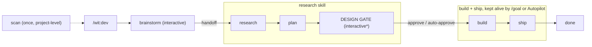

# Phase contracts & resumability

The loop is one interactive phase (**brainstorm**, run by `dev`) followed by an autonomous pipeline
(**research -> plan -> build -> ship**, sequenced by `dev`). The handoff after brainstorm is the single human
checkpoint: the user's `/goal` paste is the go, and the run continues into research in the same turn;
after it, the pipeline makes and records decisions on its own.

## State machine

\* the design gate is interactive by default; `/wit:dev --auto` auto-approves it (the same summary is
still recorded in progress.md).

`progress.md`'s Phase field names the state. Resume = read it and re-enter that phase (design-gate
re-entry has one guard; see the contracts note below). After the handoff, the only user interaction is
the design gate.

## Contracts

| Phase | Run by | Mode | Reads | Writes | May skip when |
|-------|--------|------|-------|--------|----------------|
| scan | scan | one-time | the repo | repo-map, overview, constitution | repo-map exists & current |
| brainstorm | dev | interactive | request, repo-map, constitution | brief.md | brief exists & intent unchanged |
| research | research | autonomous | brief, repo-map, constitution | research/*, .wit/adr/ADR-* (if hard-to-reverse) | approach already chosen & recorded |
| plan | research | autonomous | brief, research, repo-map, constitution | spec, tasks, pitfalls | never |
| design-gate | research | interactive* | adr, spec, tasks | dossier commit on main; gate outcome in progress.md | never: it is the second human gate |
| build | post-gate loop (/goal or Autopilot keeps it alive) | autonomous | tasks, spec, constitution | source, ticked tasks | tasks already all ticked |
| ship | post-gate loop | autonomous | the diff, spec, constitution | commits, PR (remote checks verified) | never |

*Design-gate re-entry guard (research:0): resuming into `design-gate` requires a fresh plan-mode
`verification.md`: missing, or older than `spec.md`/`tasks.md`, means the pre-gate checker pass runs
first, then the gate renders.*

## Rules

1. **Inputs before phase.** No research without a brief; no build without tasks. `dev` and the phase skills enforce order.
2. **Two gates, both deliberate.** The brainstorm handoff sets scope; the design gate confirms the
   architecture + design before any code (auto-approvable via `/wit:dev --auto`, always recorded).
   There is no third checkpoint.
3. **No questions outside the gates** (the **no-questions rule** the phase skills cite). Between
   handoff and design gate, and after design-ok, decisions
   are made on best evidence and recorded (ADR / spec / progress.md), never deferred to the user.
4. **Write decisions immediately.** The chosen approach lives in `research/` + (if notable) an ADR; scope
   lives in `spec.md`. Later phases and a resumed session read these instead of re-deciding.
5. **Amend deliberately.** If build shows the plan is wrong, update `spec.md`/`tasks.md` and note it in
   `progress.md`; don't let code and plan diverge.
6. **Each phase ends by updating `progress.md`** (Phase + a Log line). Resumability depends on it.
7. **Surface failures, don't hide them.** If the run can't finish (gate won't go green after bounded
   attempts; contradictory brief), stop, record the blocker + a clean partial state, open a draft PR or
   leave a tidy branch, and report. Hands-off is not silent.

## Skipping & re-running

- A phase whose outputs exist and whose inputs are unchanged is a no-op: read its output.
- `scan` is project-level; re-run only when the stack/layout changed or a recorded command proved wrong.

## Parallelism

Parallel is the default at every level: research fans out multiple researcher subagents in one turn; build
dispatches each wave of unblocked tasks concurrently (file-disjoint tasks share the feature worktree,
colliding ones escalate to per-task worktrees); and independent *features* from `roadmap.md` can run at the
same time in separate sessions, since each owns its worktree. The serialization points are few and
deliberate: real DAG dependencies, shared files, tests that aren't parallel-safe, and the orchestrator
being the only committer.

## Token budget

Every token the orchestrator retains is re-read on every later turn (~75× measured on a real run), so
standing weight compounds for the whole run. Two hard rules keep a hands-off run affordable; phase
skills cite them as **the context budget** and **the output house rule**:

1. **The context budget. Hold at most:** `constitution.md`, `repo-map.md`, the feature's
   `progress.md`, and the one artifact for the active phase. `progress.md` is the state of record:
   phase re-entry reads it (plus the active artifact) and **never re-Reads prior-phase artifacts**
   already summarized there. To confirm one criterion or rule, read that section, not the whole
   file. Reading beyond the budget is delegated: researchers (research) and task-runners (build)
   read sources and return summaries; an ad-hoc "let me check file X" on a large file is a
   subagent dispatch, not an orchestrator Read.
2. **The output house rule. Never pipe unbounded command output into context.** Redirect to the
   feature's log dir and read the verdict, not the stream. Once per feature:
   `mkdir -p .wit/features/<slug>/.logs && printf '*\n' > .wit/features/<slug>/.logs/.gitignore`
   (self-gitignored: the dir never enters `git status` or a dossier commit). Then per command:
   `<cmd> > .wit/features/<slug>/.logs/<name>.txt 2>&1; echo $?; tail -n 30 .wit/features/<slug>/.logs/<name>.txt`.
   On red, pull the failing lines (`grep -n -B1 -A3 -iE 'fail|error' <log>`), never the whole log;
   the file stays on disk for deeper dives and is pruned at ship's dossier tidy (wit-directory.md's
   ephemera list). Diffs enter by summary, then hunk: `git diff --stat` first, open only the hunks a
   finding needs; never read a whole diff into context.

Research and build tasks run in subagents that return summaries; their transcripts never enter the
orchestrator's context. That is what makes a hands-off, multi-file feature affordable.
The cost and the time are also *measured* where they can be, never estimated: `tokens.md` records each
subagent's **exact** usage and `Duration`, ship's `token_report.py` parses the session transcript for
the real orchestrator total and derives the autonomous wall-clock from `progress.md`'s OS-clock Log
stamps, and anything unobservable is written `unavailable`, never a fabricated number. The full
discipline (row timing, stamp format, what ship's finalize fills) is wit-directory.md's `tokens.md`
template section; phase skills cite it as **the ledger rule**.

## Script invocation

Bundled scripts run as `python` plus the script's `${CLAUDE_PLUGIN_ROOT}` path; where `python` does not
resolve, fall back to `py -3` (Windows) or `python3` (Linux/macOS). Every skill's script call inherits
this; skills cite it as **the python fallback** instead of restating it.
