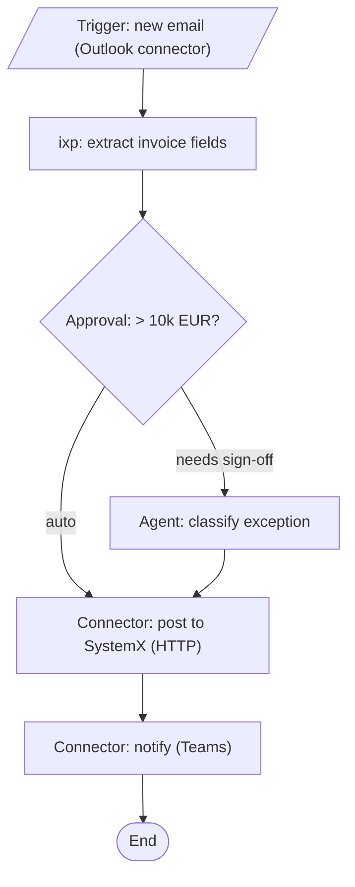

# Maestro flow architecture & the solution flow diagram

Used when **`Framework: maestro`** (the REFramework path is `refr-architecture.md`). A UiPath **Maestro flow**
(`.flow`) is an **orchestration flow of nodes**, not a queue-based state machine: there is no Dispatcher/
Performer, no `Config.xlsx`, no queue transaction loop. A flow wires a **trigger** through **nodes**
(**connector** (Integration Service), **approval** (human-in-the-loop), **script**, **subflow**, **agent**
(a UiPath Agent call), **ixp** (document understanding)) to an end. Build/validate/eval are delegated to
the `uipath-maestro-flow` skill (`uip maestro flow`).

There are **two** architecture artifacts, mapping to the SDD:

- **`architecture.md` (run/solution level) = the flow diagram (sdd:2):** the whole solution: every flow,
  its trigger, the systems/connectors/agents it touches, and any subflows.
- **per-process flow diagram (sdd:7.1.3):** one process's flow, the zoom-in (lives in that process's
  `tobe.md` / sdd:7.1.3).

Both are mermaid and **must be validated** with
`${CLAUDE_PLUGIN_ROOT}/skills/scan/scripts/check_mermaid.py` (safe node IDs: never `graph`/`end`/etc.;
quote labels containing `:` `/` `(`).

## Flow diagram: whole solution

Show the trigger, each node in order, the systems/connectors/agents touched, approvals, and any subflows.
Example:



Scale it to the real solution: one node per connector/approval/script/subflow/agent/ixp step; show every
external system and each human-approval branch. Keep node IDs short and safe; quote labels with special
characters.

## What a Maestro flow is (the skeleton)

```
project.json            # Maestro flow project descriptor
<flow>.flow             # the flow: nodes + connections (trigger -> nodes -> end)
<subflow>.flow          # optional subflows invoked by the main flow
```

No `Framework/`, no `Main.xaml` state machine, no `Data/Config.xlsx`. Configuration/secrets are connections
and Orchestrator assets referenced by the connector/agent nodes, never hardcoded.

## The Maestro build DAG (drives parallelism)

`tasks.md` orders the build:

1. **Shared components** (Wave 1): anything in `.wi/components.md` the flows depend on, first.
2. **Per-flow scaffolds**: each `.flow` (independent flows in parallel).
3. **Subflows**: independent subflows within a flow in parallel; the main `.flow` serializes its wiring.
4. **Wire-up**: connections / triggers / agent registrations via `uipath-platform`.

## When Maestro fits

Maestro suits orchestration-shaped work: human approvals/HITL, Integration Service connectors, UiPath
Agent calls, long-running/wait-heavy steps, document understanding (ixp), branching across systems.
High-volume queue-based batch transaction processing stays **REFramework** (`refr-architecture.md`). The
brainstorm proposes the framework from this shape and the gate confirms it.
