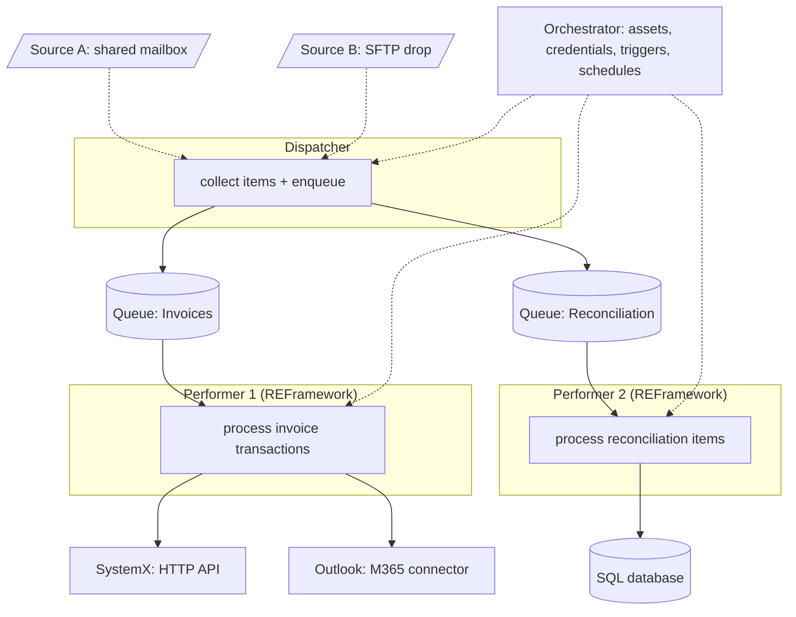

# REFramework architecture & the solution runtime diagram

Used when **`Framework: reframework`** (the Maestro path is `maestro-architecture.md`). The house default is
the **Robotic Enterprise Framework** (REFramework): a state-machine template with queue-based transaction
processing and built-in retry/exception handling. There are **two** architecture artifacts, mapping to the
SDD:

- **`architecture.md` (run/solution level) = the "Runtime diagram" (sdd:2):** the **whole solution**:
  the Dispatcher, **every Performer (including a 2nd/3rd)**, all queues, the external systems, and the
  Orchestrator. This is the detailed picture of the entire process landscape, not a single process.
- **per-process flow diagram (sdd:7.1.3):** one process's TO-BE flow, the zoom-in (lives in that
  process's `tobe.md` / sdd:7.1.3).

Both are mermaid and **must be validated** with
`${CLAUDE_PLUGIN_ROOT}/skills/scan/scripts/check_mermaid.py` (safe node IDs: never `graph`/`end`/etc.;
quote labels containing `:` `/` `(`).

## Runtime diagram: whole solution (the detailed one)

Show the full landscape: who collects work, every performer that consumes it, the queues between them, the
systems each touches, and Orchestrator. Example with a dispatcher + two performers:



Scale it to the real solution: one Dispatcher node (or none, if items arrive pre-queued), one subgraph per
Performer, one node per queue and per external system, plus Orchestrator. Keep node IDs short and safe and
quote any label with special characters.

## REFramework skeleton (what each Performer is)

```
project.json
Main.xaml                # state machine: InitAllSettings -> GetTransactionData -> Process -> SetTransactionStatus -> (End)
Data/Config.xlsx         # Settings / Constants / Assets
Framework/
  InitAllSettings.xaml · InitAllApplications.xaml · GetTransactionData.xaml
  Process.xaml           # THE business logic = the refined TO-BE steps; invokes sub-workflows
  SetTransactionStatus.xaml · CloseAllApplications.xaml
Tests/
```

A **Dispatcher** is usually its own process/project that only populates a queue. A **Performer** is the
REFramework above consuming one queue. A solution may have several performers (one per queue/work type);
the runtime diagram must show all of them.

## The multi-process build DAG (drives parallelism)

`tasks.md` orders the build so the parallel-wave engine can fan out:

1. **Shared components** (Wave 1): anything in `.wit/components.md` the processes depend on, first.
2. **Per-process scaffolds**: each Dispatcher/Performer REFramework project (independent ones in parallel).
3. **Sub-workflows**: independent sub-workflows within a process in parallel; `Main.xaml`/`Config.xlsx`
   serialize.
4. **Wire-up**: queues/assets/triggers via `uipath-platform`.

Same "shared foundation as an early task so the rest fan out" rule as `wit:dev`, applied at the process
level then again at the sub-workflow level.
