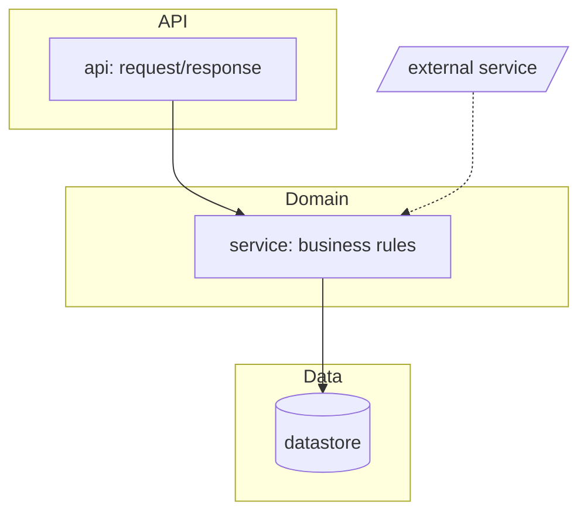

# /wi:scan (understand the project, then bootstrap wi)

Two jobs:

1. **Understand** what's in this folder and write it down.
2. **Bootstrap** wi: the constitution, and the optional plugins wi leans on.

Already scanned? **`/wi:scan --refresh`** (section below) re-verifies instead of re-documenting.

Design rationale for this skill lives in the wi repo's `docs/wi-design-notes/scan.md` (maintainer doc,
never loaded at runtime).

Outputs (all under a committed `.wi/`):
- `repo-map.md`: terse facts (stack, the exact test/lint/typecheck/run commands, layout, conventions).
  Read by every later phase.
- `overview.md`: readable documentation of an **existing** project (skipped for greenfield).
- `architecture.md`: a **mermaid** diagram of the architecture (existing projects only).
- `constitution.md`: the project's ground rules (bootstrapped if absent).

Plus a plugin check (scan:5) that may install the skills wi delegates to.

## Procedure

1. **Confirm the root & census the folder.** `git rev-parse --show-toplevel` (init only if the user wants
   it). Decide **greenfield vs existing**: `git ls-files | wc -l` plus a top-level listing. A near-empty
   folder is greenfield; anything with real source is existing.

2. **If existing code, understand and document it.** Use the cookbook in
   `${CLAUDE_PLUGIN_ROOT}/skills/scan/references/stack-detection.md` to read config/lock files (not source
   wholesale) and produce the three files from the templates below: `repo-map.md`, `overview.md`,
   `architecture.md`. On a large repo, **dispatch a subagent** to read broadly and return the filled-in
   templates; never pull the whole tree into this context.

   **If greenfield (empty, or no stack detectable), run a guided setup; don't just mark it UNKNOWN.**
   In one focused round (AskUserQuestion, folded into the constitution-confirm of scan:4 so the user
   answers once), define:
   - primary language(s) + version, framework(s), and package manager;
   - the intended **test / lint / format / typecheck / run** commands.
   Offer per-language defaults and let the user confirm or override: Python →
   uv · pytest · ruff · mypy · src layout; Node/TS → pnpm · vitest · eslint · prettier · tsc. Write the
   confirmed answers into `repo-map.md` (`Kind: greenfield`) and seed `constitution.md` from them; skip
   `overview.md`. Anything the user genuinely can't answer → `UNKNOWN - ask`; don't invent it. Also drop
   a stack-appropriate `.gitignore` (caches, build artifacts, `.wi/features/*/.logs/`: wi's redirected
   command output).

3. **Classify frontend / backend / both.** A UI framework in `package.json` or a `components/` tree ⇒
   frontend present. Record it; build routes `[frontend]` tasks to a design skill.

4. **Bootstrap the constitution.** If `.wi/constitution.md` is absent, copy
   `${CLAUDE_PLUGIN_ROOT}/skills/scan/references/constitution-template.md`, fill in what you detected, and
   ask the user to confirm the few lines marked `(confirm)`. If it already exists, leave it.

5. **Plugin bootstrap (offer, don't force).** Follow
   `${CLAUDE_PLUGIN_ROOT}/skills/scan/references/plugin-bootstrap.md`: check which recommended plugins are
   available; for any missing, use AskUserQuestion to offer installing them, and on yes give/run the exact
   `/plugin marketplace add` + `/plugin install` commands. wi works fully without them.

6. **Commit the scan outputs** (`repo-map.md`, `overview.md`, `architecture.md`, `constitution.md`, plus
   the greenfield `.gitignore` when one was created): `chore(wi): scan - repo docs` (the project-level
   rule in `wi-directory.md`: committed where written; a constitution override can disable wi commits to
   main).

7. **Report** (4-8 lines): stack, frontend/backend, what docs were written, which plugins are present vs
   newly installed, anything left `UNKNOWN`, and a **lean-file warning** when `constitution.md` or
   `repo-map.md` exceeds the ~150-line ceiling (wi-directory.md).

## `--refresh`: drift check + memory hygiene (already-scanned projects)

`--refresh` keeps the `.wi/` facts honest **without re-documenting**: verify what a later phase would
actually trust, touch only what drifted. Precondition: `.wi/repo-map.md` exists (otherwise this IS a
first scan: run the full procedure). `dev` runs this automatically at feature start when the scan looks
stale.

### A · Drift check (facts, not prose)

Anchor on the repo-map's `scanned <YYYY-MM-DD>` stamp and diff reality against the recorded facts:

1. **Config & commands:** `git log --since=<scan date> --name-only -- <config/lock files>` (the
   stack-detection cookbook lists them). If any changed, re-verify the affected `Commands` rows the
   cheap way (read the scripts/tool sections; run a `--version`/`--help` probe only when reading is
   inconclusive) and update `repo-map.md`. Unchanged config ⇒ commands stand; don't re-run the suite to
   "check".
2. **Stack & classification:** new language/framework in the lockfiles? frontend appeared in a
   backend-only repo? Update the facts and the frontend/backend line.
3. **Structure vs `architecture.md`:** `git diff --stat $(git rev-list -1 --before="<scan date>" HEAD)..HEAD`
   at directory level (or `git log --stat --since="<scan date>"`): modules/dirs added or removed that the
   diagram doesn't show? Update the mermaid (validate with `check_mermaid.py`, rules above) when the
   change is structural; leave it alone for churn inside existing nodes.
4. **`overview.md`:** update only sections made wrong (organization, run steps, external services).
5. **`constitution.md` is user-owned; never rewrite it.** If reality now contradicts a rule (e.g. the
   lint tool changed), surface the contradiction in the report and let the user amend.
6. **Lean check:** `constitution.md` / `repo-map.md` grown past ~150 lines → flag it in the report with
   a suggested split or trim (suggest, never rewrite).

Re-stamp `repo-map.md` (`scanned <today>, refreshed`). If the **Kind or core stack fundamentally changed**
(greenfield grew real code, repo swapped language), say so and run the full scan instead.

### B · Memory hygiene (learnings consolidation)

If `.wi/learnings.md` exists (dev or rpa projects alike), give the compounding memory a maintenance pass:

1. **Dedupe:** index lines (or detail files) describing the same gotcha → merge into one, keep the
   clearest hook, fix the links.
2. **Promote:** a learning that has recurred across features (or reads as a standing rule, not an
   incident) → fold the rule into its source of truth (`constitution.md`, user-owned: confirm with the
   user; `repo-map.md`; or `glossary.md`), then shrink the index line to a tombstone:
   `- <hook> → promoted to constitution (<date>)`. Delete the detail file once promoted.
3. **Prune stale:** the code/tool the learning warns about is gone (verify against the repo, not memory)
   → delete the detail file and its index line.
4. **Target:** keep the index readable at a glance (roughly ≤30 lines). If it's bigger after
   consolidation, the bar for "worth a line" in ship:4 was too low; note that in the report.

Glossary gets the same light pass: merge duplicate/aliased terms, drop ones the codebase no longer uses.
ADRs are **immutable history, never pruned** (supersede with a new ADR instead).

### C · Report (refresh)

Commit what drifted (`chore(wi): scan refresh`). Then report, 3-6 lines: what drifted and was fixed
(commands, diagram, facts), contradictions flagged for the user, learnings merged/promoted/pruned
(counts), or "no drift - scan is current."

## `repo-map.md` template

Open the file with OKF frontmatter (`type: Repo Map`), then the body below.

```markdown
---
type: Repo Map
title: Repo map - <project>
description: Stack, exact verified commands, and conventions scan recorded for this repo.
timestamp: <YYYY-MM-DD>
---

# Repo map  (scanned <YYYY-MM-DD>)

- **Kind:** existing | greenfield
- **Languages:** <e.g. Python 3.12, TypeScript>
- **Package manager:** <uv / poetry / pip / pnpm / npm / cargo / go mod>
- **Frontend / backend:** <backend only | frontend only | both - frameworks>
- **Layout:** <src layout? monorepo? key top-level dirs>
- **Architecture:** see `architecture.md` (mermaid module/dependency diagram)

## Commands  (verified runnable)
- **Install:** `<cmd>`
- **Test (all):** `<cmd>`     - **Test (one):** `<cmd e.g. pytest path::test_name>`
- **Lint:** `<cmd | n/a - not configured>`           - **Format:** `<cmd | n/a - not configured>`
- **Typecheck:** `<cmd | n/a - not configured>`      - **Run / dev:** `<cmd>`     - **Build:** `<cmd or n/a>`
  (write the `n/a - not configured` token verbatim when a tool genuinely isn't set up - dev's handoff
  preflight and keep-alive.md's fill rule key on that exact string; never leave the cell blank or `UNKNOWN`
  when you've *verified* the tool is absent)
- **Tests parallel-safe:** <yes / no / unknown - shared db file? fixed ports? pytest-xdist?>

## CI
- **Provider/files:** <.github/workflows/*, etc.>  - **Enforces:** <tests, lint, coverage>

## Conventions
- **Style/lint:** <ruff/eslint + notable rules>  - **Tests in:** <dir + naming>
- **Imports/module style:** <notes>

## Entry points
- <main module / CLI / server entry / app root>

## Unknowns
- <things to confirm with the user>
```

## `overview.md` template (existing projects)

Open the file with OKF frontmatter (`type: Overview`), then the body below.

```markdown
---
type: Overview
title: <project> - overview
description: A human-facing tour of what this project is and how it's organized.
timestamp: <YYYY-MM-DD>
---

# <project> - overview  (documented <YYYY-MM-DD> by /wi:scan)

## What it is
<1-3 sentences: purpose and who uses it.>

## Stack
<languages, frameworks, notable dependencies.>

## How it's organized
<top-level dirs and what lives in each; the key modules/packages and their roles.>

## Run it
<install, run/dev, test - point at repo-map.md for exact commands.>

## Data & external services
<datastores, APIs, queues, auth - or "none".>

## Conventions & gotchas
<patterns a newcomer must know; surprising bits; where NOT to go.>

## Open questions
<anything scan couldn't determine from the code.>
```

## `architecture.md` template (existing projects)

Open the file with OKF frontmatter (`type: Architecture`), then a `# Architecture - <project>` heading, a
dated line, ONE primary mermaid `flowchart` of the real architecture, then a one-line legend:

```markdown
---
type: Architecture
title: Architecture - <project>
description: Mermaid module/dependency diagram of the real architecture.
timestamp: <YYYY-MM-DD>
---

# Architecture - <project>
_Diagrammed <YYYY-MM-DD> by /wi:scan._

<the primary mermaid flowchart (shape below), then a one-line legend>
```

Example flowchart shape:



Rules: scale to the codebase (~10-25 nodes on a typical repo, fewer on a small one: 5 honest nodes beat
12 padded ones); group with `subgraph` by layer/area; nodes are modules/components, **not files**;
edges are real dependencies / data flow; `[( )]` = datastore, `/ /` = external system; solid =
calls/depends, dashed = optional/async.

Mermaid has two syntax traps; both **must** be avoided or the whole diagram fails to render:
1. **Quote every node label** containing `:` `/` `->` `+` `(` `)` as `id["..."]`; a bare special char
   breaks the parser.
2. **Node IDs are identifiers, not display names.** Keep them short and safe (`[a-z][a-z0-9_]*`) and
   **never use a mermaid reserved word as an ID**: `graph`, `end`, `subgraph`, `class`, `classDef`,
   `style`, `linkStyle`, `click`, `state`, `direction`, `flowchart`, `default`. Put the module's real
   name in the quoted label, not the ID: `gbuild["graph: builder / nodes"]`, **not** `graph["..."]`.
   When a module's name is a keyword, suffix the ID (`graph_mod`, `end_node`).

Add a second diagram only if it genuinely adds clarity.

**Validate the diagram for real before committing**; don't eyeball it:

```
python ${CLAUDE_PLUGIN_ROOT}/skills/scan/scripts/check_mermaid.py .wi/architecture.md
```

(python fallback: `references/workflow.md` "Script invocation".)

Fix every error the checker prints; never save a diagram that doesn't pass.

Keep these files tight and skimmable (wi-directory.md's lean-file rule); they're read at the top of
later phases.
